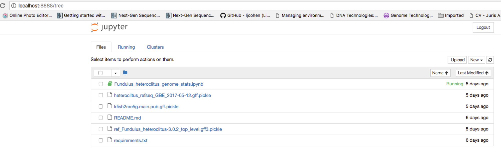

# Fundulus_heteroclitus_genome_stats

Stats and visualizations on differences between NCBI and EvidentialGene gene models.

Click here to run the jupyter notebook on an AWS cloud instance:

[](https://mybinder.org/v2/gh/ljcohen/Fundulus_heteroclitus_genome_stats/master)

To execute a cell, type `Shift-Enter` (press and hold the `Shift` key, then press `Enter`).

To run a copy of this [Jupyter notebook](http://jupyter.readthedocs.io/en/latest/install.html)
([more info on Jupyter notebooks](http://angus.readthedocs.io/en/2017/Jupyter-Notebook-Notes.html)) on your local computer:

1. Install [Miniconda](https://conda.io/miniconda.html).

If you're on AWS, or other UNIX machines:
```
wget https://repo.continuum.io/miniconda/Miniconda3-latest-Linux-x86_64.sh -O miniconda.sh && bash miniconda.sh -b -p $HOME/miniconda
echo 'export PATH="$HOME/miniconda/bin:$PATH"' >> $HOME/.bashrc
```

If you're on Mac OS:
```
curl -OL https://repo.continuum.io/miniconda/Miniconda3-latest-MacOSX-x86_64.sh
bash Miniconda3-latest-MacOSX-x86_64.sh
echo 'export PATH="$HOME/miniconda/bin:$PATH"' >> $HOME/.bashrc
```

2. Run jupyter notebook:

```
git clone https://github.com/ljcohen/Fundulus_heteroclitus_genome_stats.git
cd Fundulus_heteroclitus_genome_stats
jupyter notebook
```

A web browswer should open with a list of files, like this:



Click on `Fundulus_heteroclitus_genome_stats.ipynb` to run a live version of the notebook.


This will be your local copy. The file saved on github is preserved. So, go ahead and make some changes! If you delete everything, the copy will still be on github.
